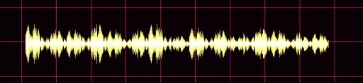

### About the Project
This Open-Source [project](https://github.com/sreecodeslayer/ml-am-lm-cmusphinx/) is a W.I.P that aims at delivering a proof of how can Speech Recognition of Malayalam be done by developing a Statistical Language Model and a corresponding Acoutic Model. This project was a part of Google Summer of Code 2016, done under Indic Project Open Source Organinsation.



The language model and acoustic model can be used on various platform, to develop applications. For example, the very same Language model and Acoustic Model can be used to develop an Android Voice Typing, Searching etc. This opens up a wide variety of possibilities in the field of using the Language in audience based applications.

<iframe src="https://ghbtns.com/github-btn.html?user=sreecodeslayer&repo=ml-am-lm-cmusphinx&type=star&count=true&size=large" frameborder="0" scrolling="0" width="160px" height="30px"></iframe><iframe src="https://ghbtns.com/github-btn.html?user=sreecodeslayer&repo=ml-am-lm-cmusphinx&type=fork&count=true&size=large" frameborder="0" scrolling="0" width="160px" height="30px"></iframe>

### Wish to develop for your language?
Well, I can help you get started with where you have to search and what to install. The CMU Sphinx Documentation can be found [here](http://cmusphinx.sourceforge.net/wiki/tutorial) as long as it is available there!

Instructions to use this Model for demo purpose ( I recommand using Unix-like enivironment ).

Firstly download the latest libraries needed to run the recognition:

1. [SphinxBase](http://sourceforge.net/projects/cmusphinx/files/sphinxbase/5prealpha)

2. [PocketSphinx](http://sourceforge.net/projects/cmusphinx/files/pocketsphinx/5prealpha)

3. [SphinxTrain](http://sourceforge.net/projects/cmusphinx/files/sphinxtrain/5prealpha)

4. [Sphinx4](http://sourceforge.net/projects/cmusphinx/files/sphinx4/5%20prealpha)

For more details head over to [CMUSphinx Download](http://cmusphinx.sourceforge.net/wiki/download)

Once you have downloaded, extracted to their corresponding folder, install them using:

In a unix-like environment (such as linux, solaris etc):<br>
If you downloaded directly from the CVS repository, you need to do
   this at least once to generate the "configure" file:

```
  $ ./autogen.sh
```

If you downloaded the release version, or ran "autogen.sh" at least
   once, then compile and install:

```
   $ ./configure
   $ make clean all
   $ make check
   $ sudo make install
```

Now, download the zip of this repository, extract and open terminal inside the root folder.

Connect the microphone and use the command below to run the recognition.
I cannot assure accuracy as of yet as this a trail attempt towards building a more spanned model.

```
pocketsphinx_continuous -hmm ./ -lm samsaaram.arpa -dict samsaaram.dic -inmic yes | tee ml_terminal_output_export.txt
```

#### Note:
> The installation of libraries can throw many errors depending on the various dependencies of ```autogen``` , ```configure``` , ```make``` . Make sure to patiently resolve those to have a successful installation. Also make sure to set the path variables in the environment.
Audio driver package(s) (```osspd``` generally) of your system might need updation while launching the command : 
>```
>pocketsphinx_continuous``` 
 If so, then try this and all should probably run fine after.

```
$ sudo apt-get update
$ sudo apt-get install osspd
```

## Wish to use my Models?
Well, you are more than welcome to use the models. Don't forget to see the <i>'license'</i>. Head over inside the repository to find the models or simply [click me](https://github.com/sreecodeslayer/ml-am-lm-cmusphinx/tree/master/Further%20development%20files/OUTPUT)

### Running the model:

1. Open up the terminal in the root directory where you downloaded the OUTPUT folder from my repository or ```cd``` your way through.
2. Type in the command:

```
$ pocketsphinx_continuous -hmm ./am/ -lm ./lm/ml.arpa -dict ./lm/ml.dic -inmic yes
```
> Note:
The output on the terminal is a bit sketchy since Malayalam is not supported. A workaround would be to pipe an export ( the output which is the hypothesis from pocketsphinx ) to a text file.

```
$ pocketsphinx_continuous -hmm ./am/ -lm ./lm/ml.arpa -dict ./lm/ml.dic -inmic yes | tee hypothesis.txt
```

### Using the model for Android Application:
CMU PocketSphinx already have an awesome [documentation](http://cmusphinx.sourceforge.net/wiki/tutorialandroid) for the same but if you howsoever wish to skip reading coz you are lazy, the go ahead and visit my [repository](https://github.com/sreecodeslayer/Samsaaram).

> Note:
> The models in this repo is outdated, you can use which ever model you wish to. Change it in appropriate Java class as well as in assets folder of your project.
