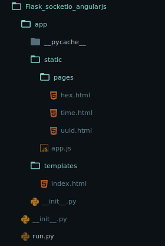

# Flask-SocketIO, AngularJS, ngRoute application

Hi everyone, am back with another tutorial for all beginners who are starting out on WebSokets and Flask Single Page apps.

### What you will need to do this tutorial:  

* You already had a good amount of exposure to Python [Flask].
* You already had a little amount of exposure to AngularJS or Javascript in general.
* You have used bootstrap.

However, these are not a necessity for you to get started. I will be providing the codes as we write the application.

### So what is WebSocket and SocketIO?
We all use a lot of [TCP](https://en.wikipedia.org/wiki/Transmission_Control_Protocol) connection everywhere in all of our websites. Now, one drawback to this protocol (well it cannot be seen as a drawback, nonetheless, t has become one lately) is that, when we have to get constant changing data from server and also send back to server, making inifinte amount of intervel requests to server (we normally call this polling) makes a huge network transfers.

Instead, a WebSocket allows a client-server connection to be persistent as long as the page is not closed. 

While the client-server is connected, both server and client can send any number of data to each other, without having to open and close new requests. This is highly useful in high data monitoring and Single Page Application.

SocketIO is a Javascript library that helps clients initiate Websocket connection and then communicate with server.

## Let's being

What our finished project structure would like:



We will first setup the backend code, and then we will move on to consume those API using the AngularJS frontend.

All the things that we do in this tutorial are for demo purpose and doesn't actually require a server to perform operations (like showing current time, making a UUID string etc.).

Before we begin, let's set the python environment. I have used Python 3 here, as eventually we all will migrate to it from Python 2. I will be using `virtualenv`, but you can use your own methods.

```bash
pip install virtualenv
virtualenv py3env
source py3env/bin/activate
```

Requirements:

```
Flask==0.12.2
Flask-SocketIO==2.9.2
gevent==1.2.2
gevent-websocket==0.10.1
```


Your `app.py` will look like this

```python
from datetime import datetime, timedelta
from threading import Lock
from flask import Flask, render_template
from flask_socketio import SocketIO
from uuid import uuid4

import time

app = Flask(__name__)
app.debug = True
app.config['SECRET_KEY'] = 'secret!'
socketio = SocketIO(app)
thread = None
thread_lock = Lock()
async_mode = None


def background_timer():
	while True:
		time.sleep(1)
		t = str(datetime.utcnow() + timedelta(hours=5, minutes=30))
		socketio.emit('time', {'data': 'This is data',
							'time': t}, namespace='/test')


@app.route('/')
def index():
	return render_template('index.html', async_mode=socketio.async_mode)

@socketio.on('connect', namespace='/test')
def connected():
	print('Client connected')
	socketio.emit('message', {'data': 'Connected', 'count': 0})
	global thread
	with thread_lock:
		if thread is None:
			thread = socketio.start_background_task(target=background_timer)

@socketio.on('disconnect', namespace='/test')
def disconnected():
	print(Client disconnected)

@socketio.on('uuid', namespace='/test')
def send_uuid():
	socketio.emit('uuid', {'uuid': str(uuid4())}, namespace='/test')

@socketio.on('hex', namespace='/test')
def send_hex():
	socketio.emit('hex', {'hex': str(uuid4().hex)}, namespace='/test')


if __name__ == '__main__':
	socketio.run(app, debug=True, port=8000)

```

As you can see, we have rendered a template in the index route. So, next we have to create that html so that we can let the browser know what exactly the users needs to see while they visit our webpage.

The easiest way to manage your render template files, is to keep them in a folder called `templates` so that Flask can automatically locate them. However you can change this, by making changes to the way render template looks for the new path.

Your `index.html` would like this:

```html
<!DOCTYPE html>
<html ng-app="ticktock">
<head>
	<title>Timer - TickTock</title>
	<base href="/">
	<!-- JQuery -->
	<script src="https://cdnjs.cloudflare.com/ajax/libs/jquery/3.2.1/jquery.min.js"></script>

	<!-- SocketIO Base -->
	<script src="https://cdnjs.cloudflare.com/ajax/libs/socket.io/2.0.3/socket.io.js"></script>

	<!-- popper js -->
	<script src="https://cdnjs.cloudflare.com/ajax/libs/popper.js/1.12.2/umd/popper.min.js"></script>

	<!-- Bootstrap 4 beta -->
	<script src="https://cdnjs.cloudflare.com/ajax/libs/twitter-bootstrap/4.0.0-beta/js/bootstrap.min.js"></script>

	<!-- AngularJS -->
	<script src="https://cdnjs.cloudflare.com/ajax/libs/angular.js/1.6.6/angular.min.js"></script>
	<script src="https://cdnjs.cloudflare.com/ajax/libs/angular.js/1.6.6/angular-route.min.js"></script>

	<!-- btford socket-io for AngularJS -->
	<script src="https://cdnjs.cloudflare.com/ajax/libs/angular-socket-io/0.7.0/socket.min.js"></script>

	<!-- Bootswatch Theme - Flatly 4 alpha -->
	<link rel="stylesheet" href="https://cdnjs.cloudflare.com/ajax/libs/bootswatch/4.0.0-alpha.6/flatly/bootstrap.min.css" />


	<!-- Main JS -->
	<script type="text/javascript" src="/static/app.js"></script>
</head>
<body ng-controller="TimeController">

<nav class="navbar navbar-toggleable-md navbar-inverse bg-primary">
	<div class="container">
		
	<button class="navbar-toggler navbar-toggler-right" 
		type="button"
		data-toggle="collapse"
		data-target="#navbarColor01"
		aria-controls="navbarColor01"
		aria-expanded="false"
		aria-label="Toggle navigation">
			
		<span class="navbar-toggler-icon"></span>
	</button>
	<a class="navbar-brand" href="/">TickTock</a>
	</div>

</nav>


<div class="container-fluid">
	<div class="row">
		<nav class="col-sm-3 col-md-2 hidden-xs-down bg-faded sidebar">
		<ul class="nav nav-pills flex-column">
			<li class="nav-item">
			<a class="nav-link" href="#!/">Current Time</a>
			</li>
			<li class="nav-item">
			<a class="nav-link" href="#!/uuid">Random UUID</a>
			</li>
			<li class="nav-item">
			<a class="nav-link" href="#!/hex">Random HEX</a>
			</li>
		</ul>
		</nav>
	</div>
	<main class="col-sm-9 offset-sm-3 col-md-10 offset-md-2 pt-3">
		
		<section class="row text-center">
			<div ng-view></div>
		</section>
	</main>
</div>

</body>
</html>

```

As you can see, we have quite a lot of libraries linked to our HTML. They are basically JQuery, AngularJS, Bootstrap and certain dependencies. I have used Bootstrap 4 (Beta) and AngularJS with Routing here, but you can always change to your prefered frontend framework. 

This HTML now needs AngularJS to communicate with our `app.py` and display the result. So let's write the JS side.

The static files like JS,CSS,Images and Fonts are all placed in a folder named as `static` just like we keep HTML files in `templates`. But if you look at the project structure I showed at the beginning, you can see that I have kept all my HTML files inside `static/pages` and only one, in `templates/index.html`. We will get to that after some time.

Your `static/app.js` would look like this:

```javascript
var tApp = angular.module('ticktock', ['btford.socket-io','ngRoute'],function($interpolateProvider){
	$interpolateProvider.startSymbol('[[');
	$interpolateProvider.endSymbol(']]');
});

tApp.factory('tAppSocket', function (socketFactory) {
  return socketFactory({
  	ioSocket: io.connect('/test')
  });
});

tApp.controller('TimeController',['$scope','$route','tAppSocket',function($scope,$route,tAppSocket){
	tAppSocket.on('time', function(data){
		$scope.time = data.time.split('.')[0];
	});
}]);


tApp.controller('UUIDController',['$scope','$route','tAppSocket',function($scope,$route,tAppSocket){
	tAppSocket.emit('uuid').on('uuid', function(data){
		$scope.uuid = data.uuid;
	});
}]);


tApp.controller('HexController',['$scope','$route','tAppSocket',function($scope,$route,tAppSocket){
	tAppSocket.emit('hex').on('hex', function(data){
		$scope.hex = data.hex;
	});
}]);


tApp.config(function($routeProvider){
	$routeProvider.when('/', {
		controller: 'TimeController',
		templateUrl: '../static/pages/time.html'
	}).when('/uuid', {
		controller: 'UUIDController',
		templateUrl: '../static/pages/uuid.html'
	}).when('/hex', {
		controller: 'HexController',
		templateUrl: '../static/pages/hex.html'
	})
})
```


Now, let's look at the last piece of code block,

```javascript
tApp.config(function($routeProvider){
	$routeProvider.when('/', {
		controller: 'TimeController',
		templateUrl: '../static/pages/time.html'
	}).when('/uuid', {
		controller: 'UUIDController',
		templateUrl: '../static/pages/uuid.html'
	}).when('/hex', {
		controller: 'HexController',
		templateUrl: '../static/pages/hex.html'
	})
})
```

This block configures the AngularJS to use ngRoute module, to direct user routes to different controller and thereby reducing the routing headaches at the server side. So, here we basically tell AngularJS to check the url the user has asked for, and then render the page from `/static/pages` with an assigned Controller for that page.
If you look at the `sidebar` that we wrote in `index.html`, the nav links are a bit messed up. i.e., they all are prefixed with a `#!`, which basically is how AngularJS(version 1.6 and above) looks for URL Routes. Refer [here](https://stackoverflow.com/questions/41226122/url-hash-bang-prefix-instead-of-simple-hash-in-angular-1-6).

With this, our app should be ready. Let's fire up the server and see how it goes. To do this, simply run the `app.py` as you would normally run a python script.